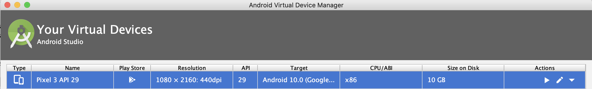
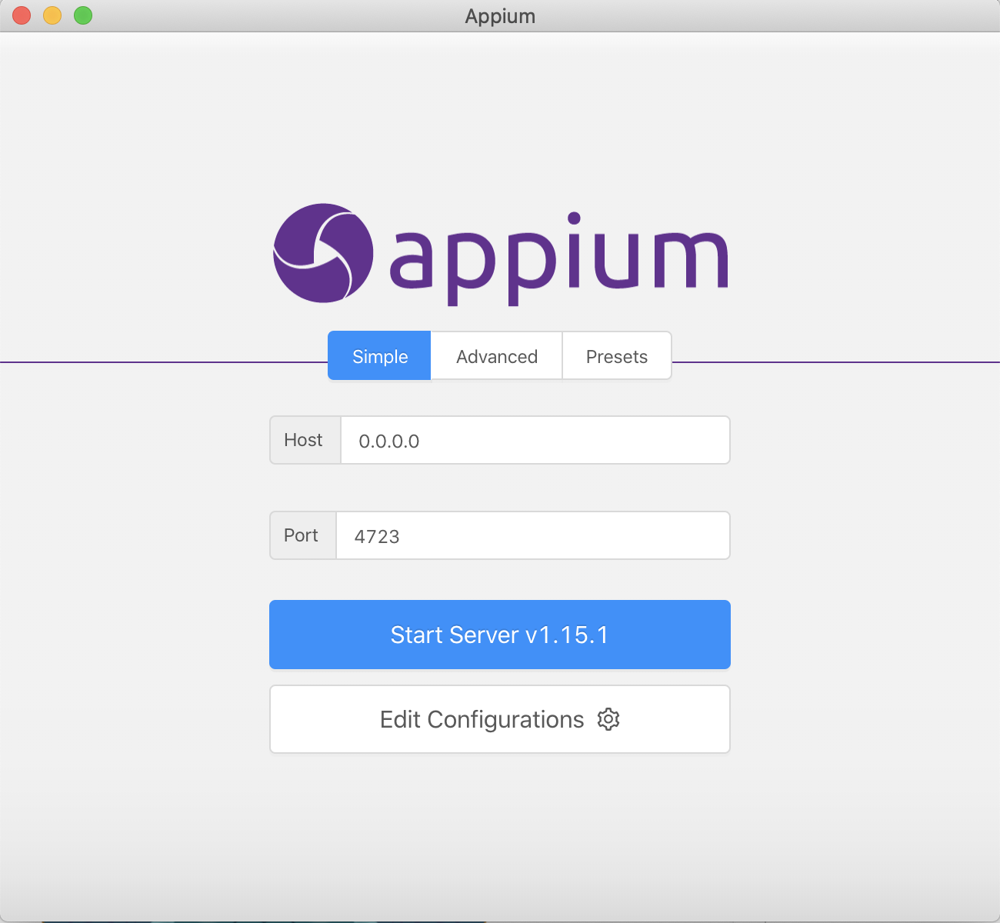

# Appium Challenge 

 Automated native Android application Ookla on an Android Emulator using javascript webdriver package WD.js and Appium.


### Prerequisites

1. node v12.12.0
2. npm 6.11.3
3. appium 1.15.1
4. Android studio SDK & AVD


### Installing

To start make sure the above dependencies are installed on your local machine as we will be using a Pixel 3 emulator (see photo below) thru the android studio AVD to run this test. 



Once that is installed and working we can run our appium server which will allow our script to communicate with the emulator. This is done thru the appium desktop application. Photo below show how it should look.



Once both the emulator and appium server are running you can start this script by running the following commands

```
cd /the/exisiting/directory
npm install
node appium.js
```

The capabilites JSON is what determines the coonnectgion between the appium server and the mobile application. This is how I have configured but may very on your emulator and device. 

```
{ 
    "deviceName": "Pixel 3 API 29", 
    "uuid": "emulator-5554", 
    "platformName": "Android", 
    "platformVersion": "10.0", 
}

The appPackage and appActivity that we will be running are as follows.

{
        appPackage: "com.google.android.apps.photos",
        appActivity: ".home.HomeActivity"
}
```
